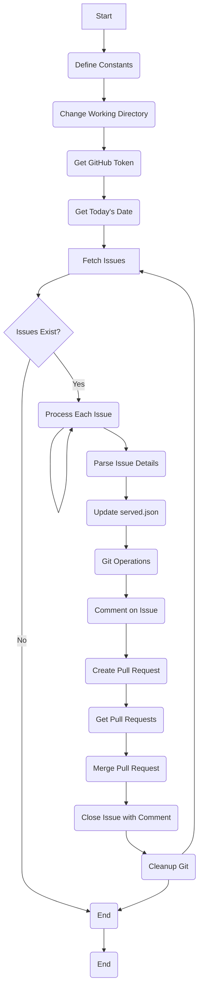
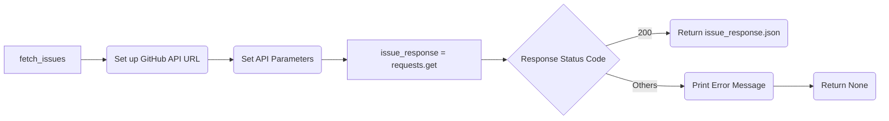
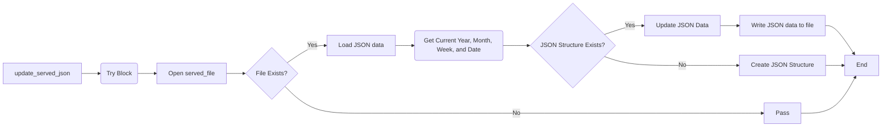
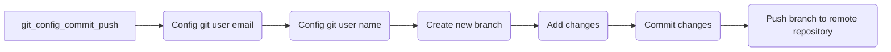
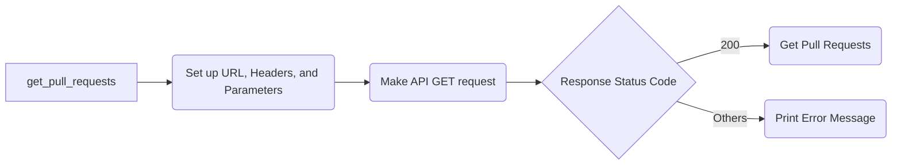
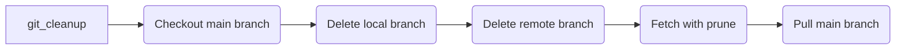

<!--suppress HtmlDeprecatedAttribute -->

<div align="center">
  <h1>Flowchart using Mermaid</h1>
  
</div>

---

## Flowchart

### 1. [main.py](../main.py)

<details>
<summary>Click to expand</summary>




</details>

### 2. Fetch Issues

<details>
<summary>Click to expand</summary>



.svg)
</details>

### 3. Update served.json

<details>
<summary>Click to expand</summary>



.svg)

</details>

### 4. Git Config_Commit_Push

<details>
<summary>Click to expand</summary>



.svg)

</details>

### 5. Comment on Issue

<details>
<summary>Click to expand</summary>

```mermaid
graph LR
    A[comment_on_issue] --> B(Set up URL, Data, and Headers)
    B --> C(Make API POST request)
    C --> D{Response Status Code}
    D -- 201 --> E(Print "Comment added successfully.")
    D -- Others --> F(Print Error Message)

```

.svg)

</details>

### 6. Create Pull Request

<details>
<summary>Click to expand</summary>

```mermaid
graph LR
    A[create_pull_request] --> B(Set up URL, Headers, and Data)
    B --> C(Make API POST request)
    C --> D{Response Status Code}
    D -- 201 --> E(Print "Pull request created successfully.")
    D -- Others --> F(Print Error Message)

```

.svg)

</details>

### 7. Get Pull Request

<details>
<summary>Click to expand</summary>



.svg)

</details>

### 8. Merge Pull Request

<details>
<summary>Click to expand</summary>

```mermaid
graph LR
    A[merge_pull_request] --> B(Set up URL, Headers, and Data)
    B --> C(Make API PUT request)
    C --> D{Response Status Code}
    D -- 200 --> E(Print "Pull request merged successfully.")
    D -- Others --> F(Print Error Message)

```

.svg)

</details>

### 9. Close Issue with Comment

<details>
<summary>Click to expand</summary>

```mermaid
graph LR
    A[close_issue_with_comment] --> B(Set up URLs and Headers)
    B --> C(Add comment to closed issue)
    C --> D{Response Status Code}
    D -- 201 --> E(Print "Comment added successfully.")
    D -- Others --> F(Print Error Message)
    F --> G(Close the issue)
    G --> H{Response Status Code}
    H -- 200 --> I(Print "Issue closed successfully.")
    H -- Others --> J(Print Error Message)

```

.svg)

</details>

### 10. Cleanup Git

<details>
<summary>Click to expand</summary>



.svg)

</details>

## References

- [Mermaid JS](https://mermaid-js.github.io/mermaid/#/)
- [Mermaid Live Editor](https://mermaid-js.github.io/mermaid-live-editor)

## License

