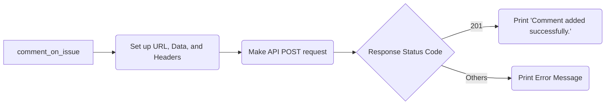
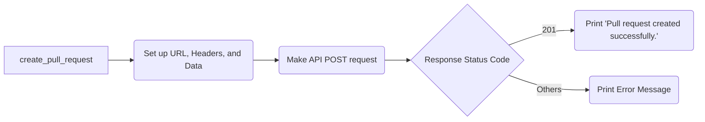
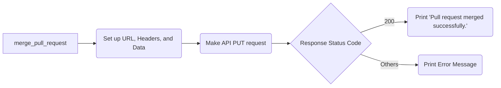
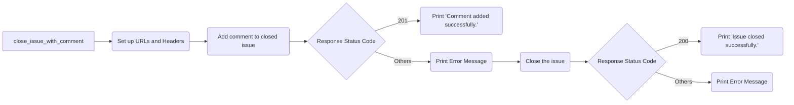

<!--suppress HtmlDeprecatedAttribute -->

  <h1>Flowchart using Mermaid</h1>
  

---

## Flowchart

### 1. [main.py](../main.py)

Click to expand

### 2. Fetch Issues

Click to expand

##### fetch_issue()

When the `fetch_issue` function is called, it set up the GitHub API URL, set API parameters, and make a
GET request to the GitHub API. If the response status code is 200, it returns the JSON data.
Otherwise, it prints an error message and returns `None`.

### 3. Update served.json

Click to expand

##### update_served_json()

When the `update_served_json` function is called, it tries to open the `served.json` file. If the file exists,
the JSON data is loaded. otherwise it creates a empty data dict() Then, it goes on to check if the necessary
JSON structure exists for the current year, month, week, and date. If the structure does not exist,
it creates it. After that, it updates the JSON data with the required information and writes the updated
data back to the file.

### 4. Git Config_Commit_Push

Click to expand

#### git_config_commit_push()

when the`git_config_commit_push function`. The flow starts with configuring the git user email, followed by
configuring the git user name. Then, it creates a new branch using the specified branch_name. Next, it adds
the changes, commits them with a commit message that includes the issue_creator as co-author's 'NAME, EMAIL,
and today information. Finally, it pushes and publish the branch to the remote repository specified by the
GitHub URL.

### 5. Comment on Issue

Click to expand

#### comment_on_issue()

When the `comment_on_issue` function is called, The flow starts with setting up the URL, data, and headers
for the API request. Then, it proceeds with making the API POST request to add the comment and obtain the
response. After that, it checks the response status code. If the status code is 201
(indicating a successful request), it prints "Comment added successfully." Otherwise,
it prints an error message that includes the response text.

### 6. Create Pull Request

Click to expand

#### create_pull_request()

When the `create_pull_request` function is called, The flow starts with setting up the URL, headers, and data
for the API request. Then, it proceeds with making the API POST request to create the pull request and obtain
the response. After that, it checks the response status code. If the status code is 201
(indicating a successful request), it prints "Pull request created successfully." Otherwise,
it prints an error message that includes the response text

### 7. Get Pull Request

Click to expand

#### get_pull_requests()

When the `get_pull_requests` function is called, The flow starts with setting up the URL, headers, and
parameters for the API request. Then, it proceeds with making the API GET request to retrieve the pull
requests and obtain the response. After that, it checks the response status code. If the status code is 200
(indicating a successful request), it retrieves the pull requests from the response and returns them.
Otherwise, it prints an error message that includes the response text and returns None.

### 8. Merge Pull Request

Click to expand

#### merge_pull_request()

When the `merge_pull_request` function is called,The flow starts with setting up the URL, headers, and data
for the API request. Then, it proceeds with making the API PUT request to merge the pull request and obtain
the response. After that, it checks the response status code. If the status code is 200
(indicating a successful request), it prints "Pull request merged successfully." Otherwise,
it prints an error message that includes the response text.

### 9. Close Issue with Comment

Click to expand

#### close_issue_with_comment()

When the `close_issue_with_comment` function is called, The flow starts with setting up the URLs and headers
for the API requests. Then, it proceeds with adding a comment to the closed issue using the comment URL and
the provided data. After adding the comment, it checks the response status code. If the status code is 201
(indicating a successful request), it prints "Comment added successfully." Otherwise, it prints an error
message that includes the response text.

If the comment is added successfully, the flow continues to close the issue by sending a PATCH request to the
issue URL with the appropriate data. Then, it checks the response status code again. If the status code is 200
(indicating a successful request), it prints "Issue closed successfully." Otherwise, it prints an error
message that includes the response text.

### 10. Cleanup Git

Click to expand

#### git_cleanup()

When the `git_cleanup` function is called, The flow starts with checking out the main branch. Then, it
proceeds with deleting the local branch specified by branch_name. After that, it deletes the corresponding
remote branch using the GitHub URL, GITHUB_PAT, AUTHOR_NAME, repository_name, and branch_name. Next,
it fetches the latest changes and prunes deleted branches. Finally, it pulls the latest changes from the main
branch.

### Complete flowchart

```mermaid
graph TD
    A[Start] --> B(Define Constants)
    B --> C(Change Working Directory)
    C --> D(Get GitHub Token)
    D --> E(Get Today's Date)
    E --> AE[Fetch Issues]
    AE[Fetch_issues] --> BE(Set up GitHub API URL)
    BE --> CE(Set API Parameters)
    CE --> DE[issue_response = requests.get]
    DE --> EAE{Response Status Code}
    EAE -- 200 --> FE(Return issue_response.json)
    EAE -- Others --> GER(Print Error Message)
    GER --> Z(End)


    FE --> G{Issues Exist?}
    G -- Yes --> H(Process Each Issue)
    G -- No --> Z(End)
    H --> I(Parse Issue Details)
    I --> JI(Update served.json)
    JI[update_served_json] --> IAI(Try Block)
    IAI --> JI[Open served_file]
    JI --> KI{File Exists?}
    KI -- Yes --> LI[Load JSON data]
    KI -- No --> PI[Create JSON Structure]
    LI --> NI(Get Current Year, Month, Week, and Date)
    NI --> OI{JSON Structure Exists?}
    OI -- No --> PI[Create JSON Structure]
    OI -- Yes --> QI[Update JSON Data]
    QI --> RI[Write JSON data to file]
    PI --> QI[Update JSON Data]



    RI --> K(git_config_commit_push)
    K[git_config_commit_push] --> UK(Config git user email)
    UK --> VK(Config git user name)
    VK --> WK(Create new branch)
    WK --> XK(Add changes)
    XK --> YK(Commit changes)
    YK --> ZK(Push branch to remote repository)


    ZK --> L(Comment on Issue)
    L[comment_on_issue] --> HH(Set up URL, Data, and Headers)
    HH --> II(Make API POST request)
    II --> JJ{Response Status Code}
    JJ -- 201 --> KK(Print 'Comment added successfully.')
    JJ -- Others --> LL(Print Error Message)
    LL --> Z(End)


    KK --> M(Create Pull Request)
    M[create_pull_request] --> NN(Set up URL, Headers, and Data)
    NN --> OO(Make API POST request)
    OO --> PP{Response Status Code}
    PP -- 201 --> QQ(Print 'Pull request created successfully.')
    PP -- Others --> RR(Print Error Message)
    RR --> Z(End)


    QQ --> N(Get Pull Requests)
    N[get_pull_requests] --> TT(Set up URL, Headers, and Parameters)
    TT --> UU(Make API GET request)
    UU --> VV{Response Status Code}
    VV -- 200 --> WW(Get Pull Requests)
    VV -- Others --> XX(Print Error Message)
    XX --> Z(End)

    WW --> O(Merge Pull Request)
    O[merge_pull_request] --> ZZ(Set up URL, Headers, and Data)
    ZZ --> AAA(Make API PUT request)
    AAA --> BBB{Response Status Code}
    BBB -- 200 --> CCC(Print 'Pull request merged successfully.')
    BBB -- Others --> DDD(Print Error Message)
    DDD --> Z(End)

    CCC --> P(Close Issue with Comment)
    P[close_issue_with_comment] --> FFF(Set up URLs and Headers)
    FFF --> GGG(Add comment to closed issue)
    GGG --> HHH{Response Status Code}
    HHH -- 201 --> III(Print 'Comment added successfully.')
    HHH -- Others --> JJJ(Print Error Message)
    JJJ --> Z(End)
    III --> KKK(Close the issue)
    KKK --> LLL{Response Status Code}
    LLL -- 200 --> MMM(Print 'Issue closed successfully.')
    LLL -- Others --> NNN(Print Error Message)
    NNN --> Z(End)


    MMM --> Q(Cleanup Git)
    Q[git_cleanup] --> BB(Checkout main branch)
    BB --> CC(Delete local branch)
    CC --> DD(Delete remote branch)
    DD --> EE(Fetch with prune)
    EE --> FF(Pull main branch)

    FF --> Z(End)
```

Click to expand(very big, may not render on mobile devices)

### Email Validation RegEx Diagram

Click to expand

## References

- [Mermaid JS](https://mermaid-js.github.io/mermaid/#/)
- [Mermaid Live Editor](https://mermaid-js.github.io/mermaid-live-editor)
- [REGEX Diagram](https://regexper.com/)

## License

